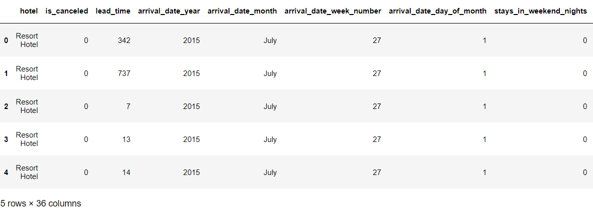
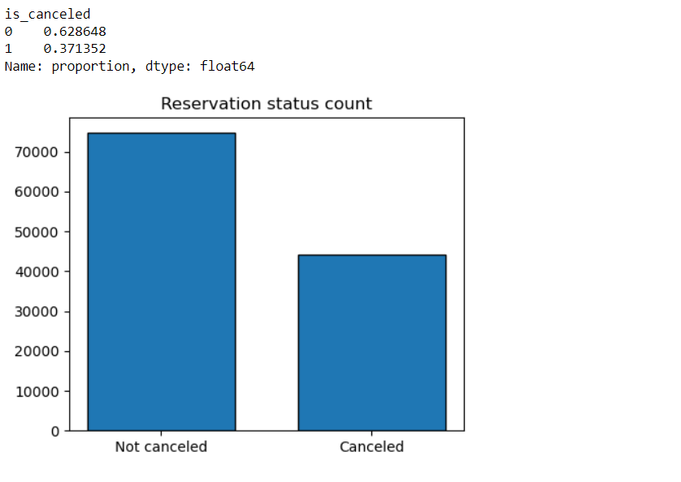
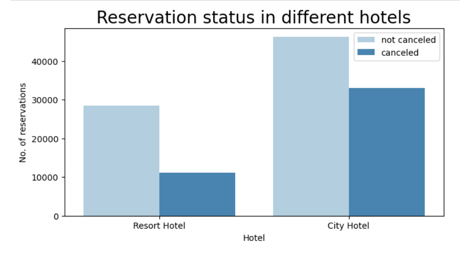
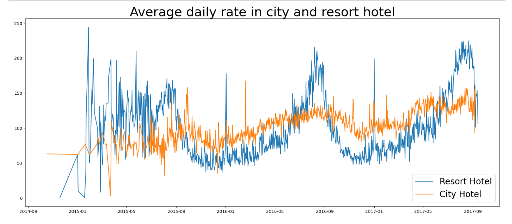
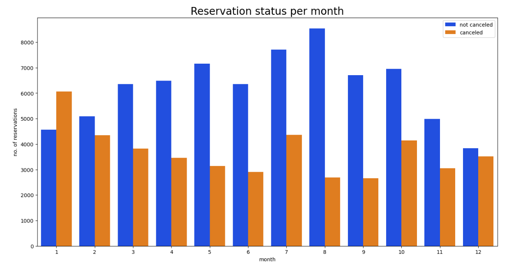
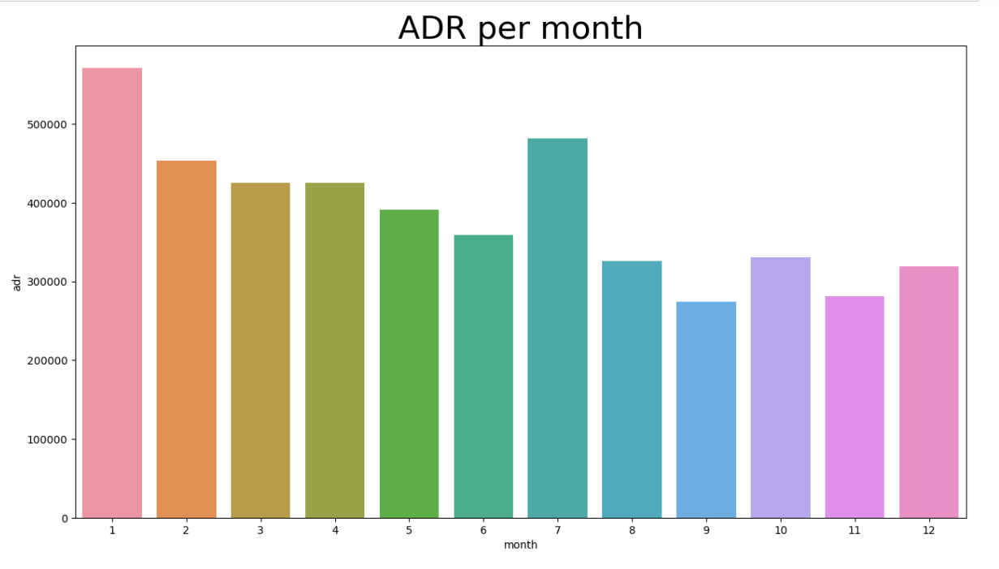
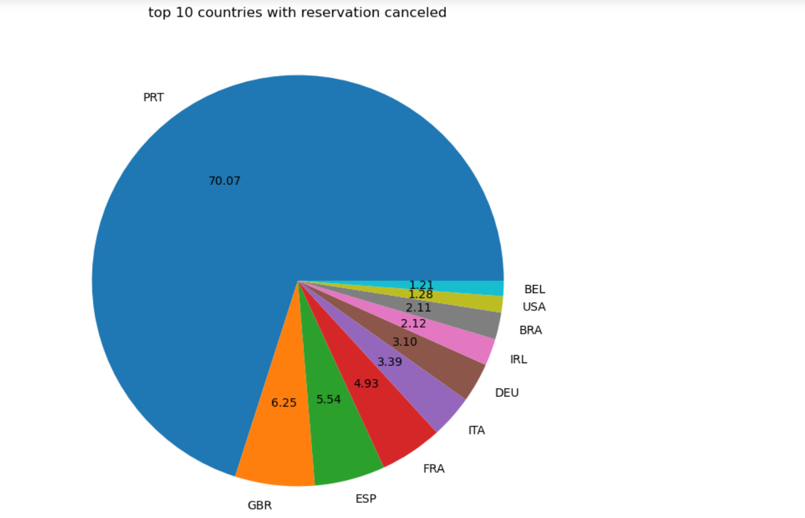
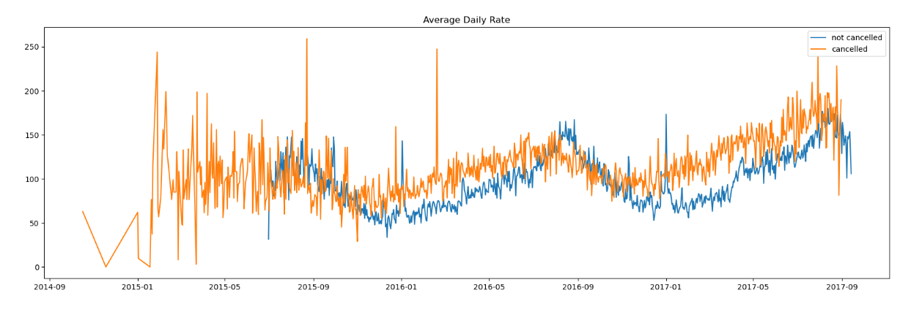
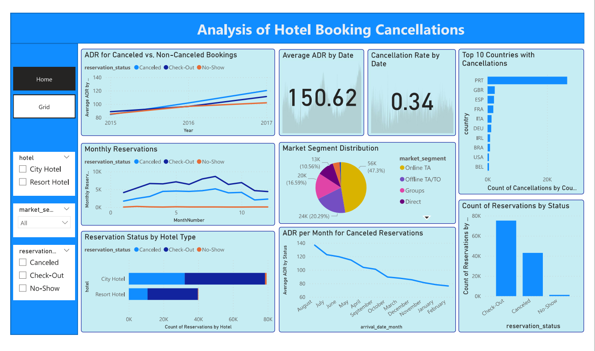
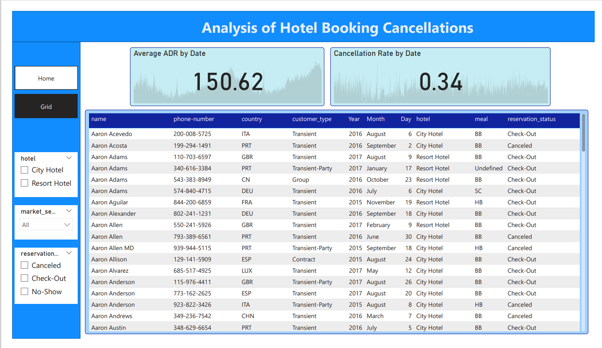

# Analysis of Hotel Booking Cancellations

This project analyzes the factors contributing to high cancellation rates at City Hotel and Resort Hotel and provides strategic recommendations to reduce cancellations and enhance efficiency.

## Business Problem

City Hotel and Resort Hotel are facing high cancellation rates, negatively impacting revenue and room utilization. Addressing this issue is crucial for improving operational efficiency and revenue generation.

## Analysis and Findings

- **Data Loading and Exploration:** Initial exploration of dataset structure and content.
  
- **Cancellation Rate:** Calculation of the cancellation rate.
- **Reservation Status Count:** Visualization of canceled vs. non-canceled reservations.
  
- **Reservation Status by Hotel Type:** Analysis of cancellations across hotel types.
  
- **Average Daily Rate (ADR) Analysis:** ADR trends over time for both hotel types.
  
- **Monthly Reservation Status:** Seasonal patterns in cancellations.
  
- **ADR per Month for Canceled Reservations:** Trends in ADR for canceled reservations.
- 
- **Top 10 Countries with Cancellations:** Countries with the highest cancellations.
  
- **Market Segment Distribution:** Analysis of bookings and cancellations by market segment.
- **ADR for Canceled vs. Non-Canceled Bookings:** Comparison of ADR over time.
  

## Power BI Dashboard



### Usage
1. Open the Power BI Desktop application.
2. Load the `Analysis-of-Hotel_Booking_Cancellations.pbix` file.
3. Explore the different KPIs and charts on the dashboard.
4. Use filters to customize the view as per your requirements.
5. Export data from the Grid View Dashboard if needed.


## Recommendations

1. **Adjust Pricing Strategies:** Offer discounts based on location and demand to reduce cancellations.
2. **Targeted Promotions:** Focus marketing efforts during high cancellation periods, such as January.
3. **Service Improvement:** Enhance services in regions with high cancellation rates to encourage bookings.
4. **Special Offers for Resort Hotels:** Provide discounts or packages during weekends and holidays to mitigate cancellations.

## User Guide

### Requirements

- Python 3.x
- Jupyter Notebook
- pandas
- matplotlib
- seaborn

### How to Run the Analysis

1. **Clone the Repository:**
   ```sh
   git clone https://github.com/harshala334/Analysis-of-Hotel-Booking-Cancellations.git
   cd Analysis-of-Hotel-Booking-Cancellations

2. **Install the Required Libraries:**
   ```sh
   pip install pandas matplotlib seaborn

3. **Open the Jupyter Notebook:**
   ```sh
   jupyter notebook Analysis-of-Hotel-Booking-Cancellations.ipynb
4. **Run the Notebook:**
   Execute each cell sequentially to perform the analysis and generate visualizations.   
      
